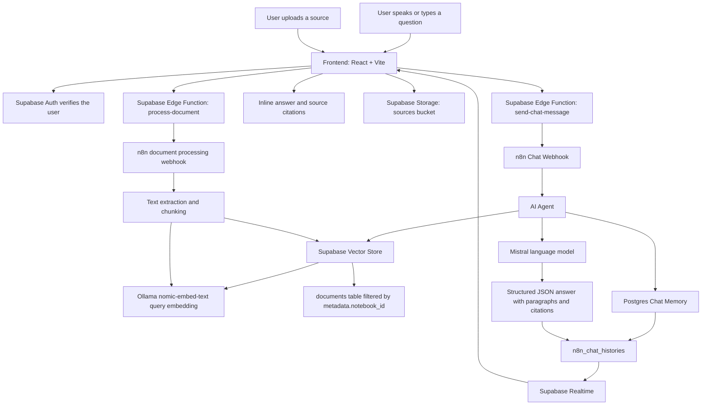

Vani is a voice-first learning assistant for people who want to understand their own documents by talking through them. Upload a textbook chapter, research paper, meeting note, or PDF, then ask questions and get answers grounded in the material you provided, with citations that show where the answer came from. It is built for students, researchers, and professionals who think better in conversation than in search boxes.

## How It Works:



The frontend does not call n8n directly. It calls Supabase Edge Functions, and those functions forward authenticated requests to the self-hosted n8n webhooks. n8n handles document processing, retrieval, memory, and model orchestration, while Supabase stores users, files, vectors, chat history, and realtime updates.

## Current Features

Vani lets a user create notebooks and attach sources such as PDFs, text, websites, YouTube links, and audio files.

Vani stores uploaded knowledge as searchable chunks in Supabase Postgres with pgvector, using Ollama `nomic-embed-text` embeddings for retrieval.

Vani retrieves only the chunks most relevant to a question, filtered to the current notebook, so answers stay grounded in the user's own material.

Vani sends chat requests through Supabase Edge Functions into n8n, where an AI agent combines vector retrieval, chat memory, and Mistral responses.

Vani renders cited answers in the frontend so users can inspect which source and line range supported the response.

Vani keeps conversation history in Postgres-backed chat memory, giving each notebook continuity across messages.

## Tech Stack

| Component | Technology |
|---|---|
| Frontend | React, Vite, TypeScript, Tailwind CSS, shadcn-ui |
| Authentication | Supabase Auth |
| Vector Database | Supabase Postgres with pgvector |
| Embeddings | Ollama `nomic-embed-text` |
| Language Model | Mistral |
| Workflow Orchestration | Self-hosted n8n |
| Chat Memory | n8n Postgres Chat Memory backed by Supabase Postgres |
| Voice (Coming Soon) | Real-time voice conversations, resumable sessions, and future phone-call mode |

## Getting Started

1. Set up a remote Supabase project.

   Create a Supabase project in the cloud and run the SQL migration in `supabase/migrations/20250606152423_v0.1.sql`. The migration enables pgvector, creates the application tables, configures storage buckets, and defines the `documents` table with `embedding vector(768)` for the current Ollama `nomic-embed-text` setup.

2. Deploy the Supabase Edge Functions.

   Deploy the functions in `supabase/functions`. Keep the existing function names unchanged, including `generate-notebook-content`, `send-chat-message`, `process-document`, `process-additional-sources`, `generate-audio-overview`, and the callback functions. The frontend depends on these names.

3. Configure your self-hosted n8n instance.

   Import the Vani workflow JSON files from the `n8n` directory into your self-hosted n8n VM. These JSON files are not executed by the frontend directly; they are repository backups and setup references for the workflows that must be running inside n8n.

4. Set the required n8n credentials.

   Configure credentials in n8n for Supabase, Mistral, Ollama, and Postgres. The chat workflow must use the same embedding model and vector dimension as the document-ingestion workflow.

5. Set Supabase Edge Function secrets.

   These values are set inside the Supabase dashboard under Edge Function secrets, not in the frontend `.env` file:

   - `NOTEBOOK_CHAT_URL` — the n8n webhook URL used by `send-chat-message`.
   - `NOTEBOOK_GENERATION_URL` — the n8n webhook URL used by `generate-notebook-content`.
   - `NOTEBOOK_GENERATION_AUTH` — the shared header-auth value sent from Supabase Edge Functions to n8n.
   - `DOCUMENT_PROCESSING_WEBHOOK_URL` — the n8n webhook URL used by `process-document`.
   - `ADDITIONAL_SOURCES_WEBHOOK_URL` — the n8n webhook URL used by `process-additional-sources`.
   - `AUDIO_GENERATION_WEBHOOK_URL` — the n8n webhook URL used by `generate-audio-overview`.

6. Set up the frontend.

   Clone the repository, install dependencies, copy `.env.example` to `.env`, and fill in:

   ```env
   VITE_SUPABASE_URL=
   VITE_SUPABASE_ANON_KEY=
   ```

   Then start the frontend:

   ```bash
   npm install
   npm run dev
   ```

<!-- add app screenshot after UI rebuild -->

## Roadmap

### Voice

Vani is moving toward real-time voice conversations where the user can talk naturally and hear grounded answers back. The goal is not just dictation, but a learning session that feels like discussing a topic with someone who has read every uploaded source. Over time, these sessions should become resumable across days and eventually work as a true phone-call mode while commuting.

### Collaboration

Vani should support shared notebooks where multiple people can talk to the same knowledge base and build understanding together. A public knowledge library can let students and researchers publish useful notebooks for others, turning private study material into reusable learning spaces.

### Access

Vani should become easier to use across languages and devices, starting with Hindi and a mobile-first experience. The long-term direction is a learning assistant that feels available wherever the user has a few minutes to speak, listen, and continue.

## Contributing

Contributions are welcome through open issues, especially around voice interaction, citation reliability, document processing, multilingual support, and mobile-first learning flows. The most valuable work right now is practical: make Vani more accurate, easier to run, and closer to a natural conversation with a user's own knowledge.
